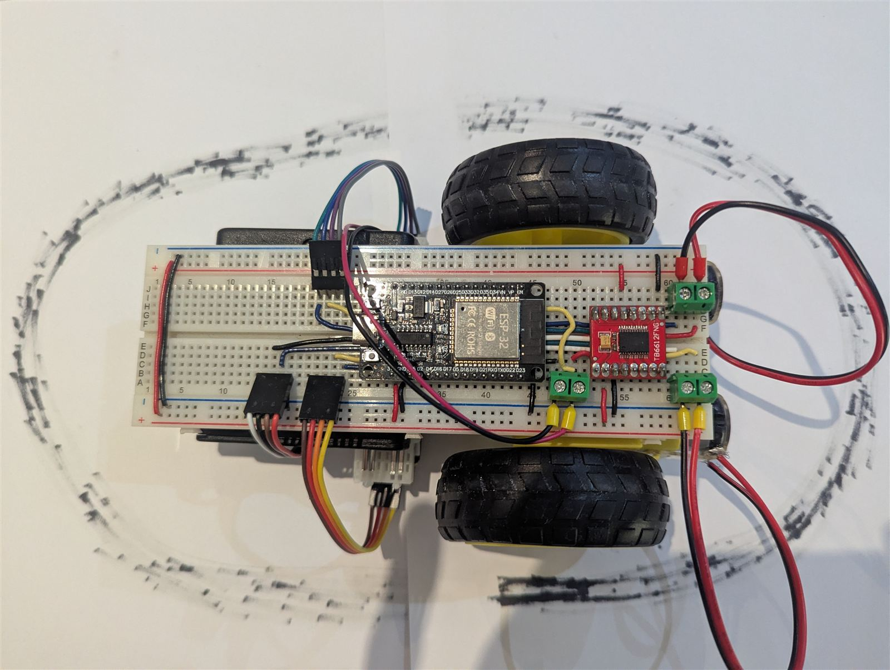
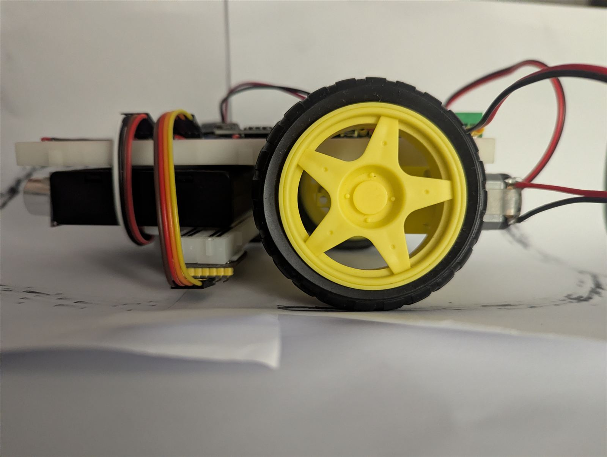
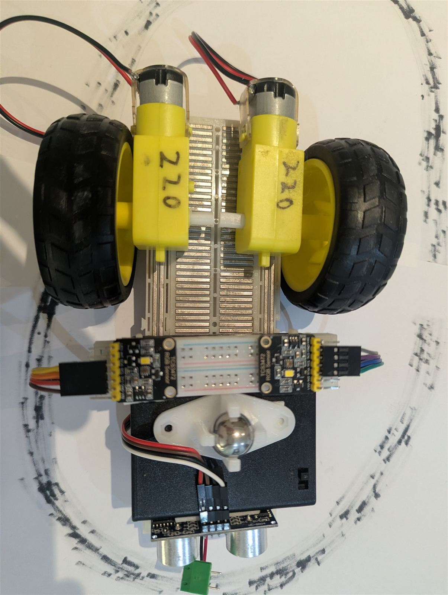
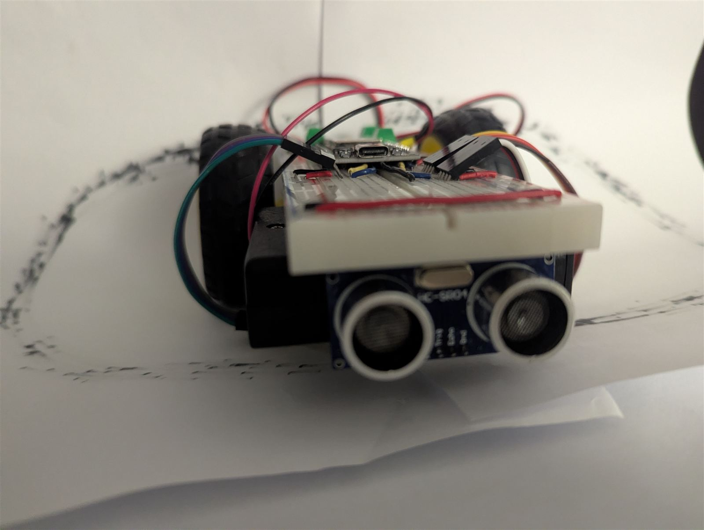
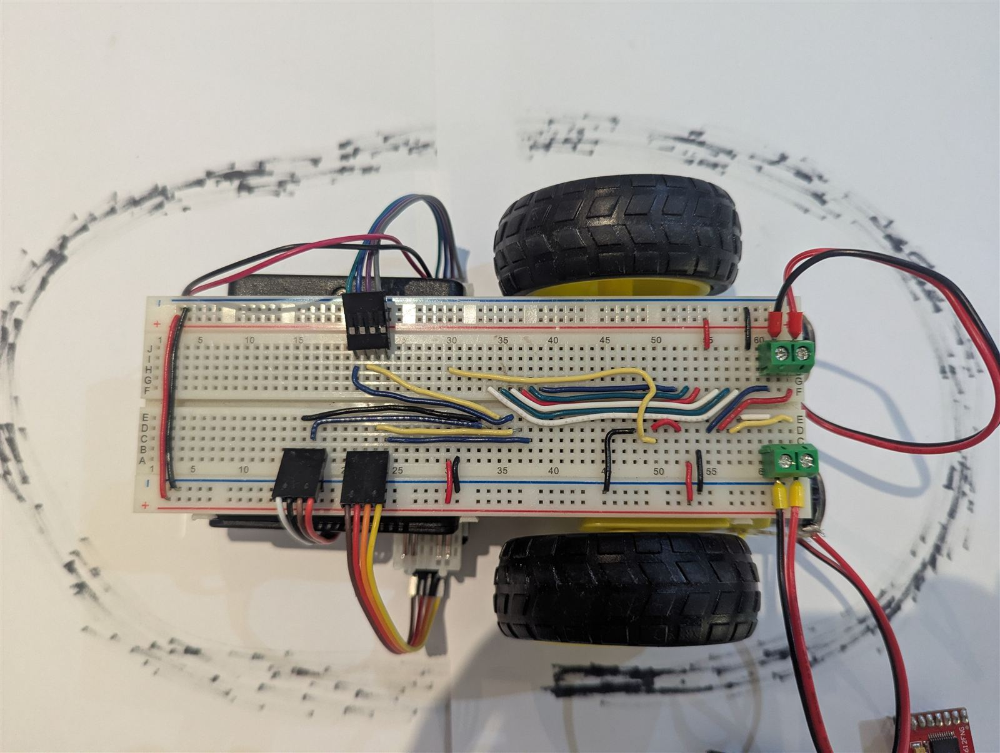

# RoboCup Rescue Robot

A two-sensor line-following robot with an ESP32 for [RoboCup Rescue Australia Junior](https://www.robocupjunior.org.au/wp-content/uploads/2026/02/RCJA-Rescue-Line-Rules-2026.pdf). This is intended to guide learning, the functionality is intentionally incomplete.





## Hardware

- ESP32 DevKit (WROOM-32)
- TB6612FNG motor driver
- 2× TCS34725 RGB colour sensor
- 2× TT motor (220:1) + wheel
- HC-SR04 ultrasonic distance sensor
- Caster ball
- 4×AA battery holder with switch
- Breadboard and 22 AWG hookup wire





## Wiring

| Peripheral            | ESP32 pins                          |
| --------------------- | ----------------------------------- |
| Right motor (TB6612)  | FWD 25, BWD 33, PWM 32              |
| Left motor (TB6612)   | FWD 26, BWD 27, PWM 14              |
| Left colour sensor    | I2C bus 0 - SDA 18, SCL 5          |
| Right colour sensor   | I2C bus 1 - SDA 17, SCL 16         |
| Ultrasonic (HC-SR04)  | TRIG 2, ECHO 4                      |
| Start button          | GPIO 0 (on-board BOOT button)      |

The two colour sensors share the same I2C address, so each sits on a separate ESP32
hardware I2C bus (see [I2C](#i2c) below).



## Getting Started

I used visual studio code with PlatformIO, but the code can also run with the Arduino IDE.

1. **Install Visual Studio Code** — download from
   [code.visualstudio.com](https://code.visualstudio.com/) and run the installer.

2. **Install the PlatformIO IDE extension** — in VS Code open the Extensions panel
   (`Ctrl+Shift+X`), search for *PlatformIO IDE*, and click Install. It bundles
   PlatformIO Core and the toolchains, so no separate Python or compiler setup is
   needed. Wait for the one-time install to finish and reload when prompted.

3. **USB-to-serial driver**
   - **Windows** — open Device Manager and look under *Ports (COM & LPT)* for an
     entry like `Silicon Labs CP210x ... (COM3)` or `USB-SERIAL CH340 (COM5)`. A
     device under *Other devices* with a yellow warning triangle means the driver
     is missing, and will need to be installed
   - **macOS / Linux** - Should work by default

4. **Open the project** — clone or download this repository, then in VS Code choose
   *File → Open Folder* and select the `line_follow_esp32` folder. PlatformIO reads
   [platformio.ini](platformio.ini) and downloads the ESP32 platform and the
   Adafruit TCS34725 library automatically on the first build.

5. **Connect the ESP32** over USB and use the PlatformIO toolbar at the bottom of
   VS Code, or the terminal:

   ```sh
   pio run                 # compile
   pio run --target upload # flash over USB
   pio device monitor      # serial monitor @ 115200 baud
   ```

## Behaviour

On startup, print sensor information until button pressed. Then, obot moves forward until one sensor sees black. The robot will turns towards the black to keep straddling the line. When green shortcut is detected, it will make a turn in that direction. If both sensors see green, it will halt.

## Tips

### Complexity

Reducing complexity means more reliable, cleaper, and less time wasted. I recommend avoid adding hardware that isn't needed, such as additional microcontrollers, batteries, or sensors. 

### Microcontroller

Microcontrollers differ in their capabilities, so check that your chosen board has
enough pins of the right type for your peripherals: regular GPIO, I2C, PWM, and
analog input. Some pins are reserved for internal purposes, boot settings, buttons, LEDs which should be avoided. I chose the ESP32 because it has plenty of pins, multiple I2C buses, fits
a breadboard, includes WiFi and Bluetooth, has USB-C, and is cheap. The microbit is another compelling option which includes a speaker, LED matrix, microphone, accelerometer, bluetooth, visual programming, and buttons but only had 1 I2C and less GPIO pins.

### I2C

I2C is a bus protocol that drives multiple devices over SDA, SCL, VCC, and GND.
However, most microcontrollers expose a single I2C bus on fixed pins, and you can't
put two devices with the same address on one bus. This causes problems when connecting
multiple colour sensors. Your options:

- Sensors with a configurable address (e.g. OPT4048)
- An I2C multiplexer (e.g. TCA9548A)
- A microcontroller with multiple I2C buses (e.g. ESP32)
- Multiple microcontrollers ☹️

### Motors

TT motors have different speed ranges depending on gear ratio. The common 50:1 ratio
usually runs too fast for line following. Check the minimum RPM against your wheel
diameter to confirm the slowest speed isn't too fast.

### Battery

Motors draw high current, which can trigger a 'brownout'. A brownout is a microcontroller reset from low voltage. A 9V "smoke detector" battery can't deliver enough power to run
motors; I used a 4×AA holder with a switch. If brownouts persist on a decent battery,
capacitors help absorb the surges from motor direction changes. Use the largest you
can (100 µF or more) in parallel with the battery and the microcontroller - the more
the better. If that still isn't enough, run a separate small battery for the digital
electronics and a larger one for the motors.

### Connections

Reliable connections are critical. Soldered joints or screw terminals are the most reliable; breadboards offer convenience, reasonable reliability and compactness for
prototyping. I use 22 AWG solid-core wire cut to length on the breadboard, soldered multicore cable with 0.2" screw terminals to
the motors, and DuPont jumpers for the
ultrasonic and colour sensors.

### Multidirectional wheel

Two driven wheels need a third contact point - an omniwheel, caster wheel, or caster
ball. I used a caster ball. I tried a low-friction sliding "foot" but it hindered turning. Whatever
you pick must clear debris and the bumpy tile.

### Sensor positioning

The height and spacing of the colour sensors matters. Sensors too far ahead of the
wheels can't react to sharp turns; sensors too close together can't keep the line
between them.

### Slipping

Weight distribution matters too. Too front- or back-heavy and the robot may roll over
finishing the seesaw. Too little weight over the driven wheels and they lose grip
uphill - especially as they pick up dust. Clean the course and wheels before starting.
